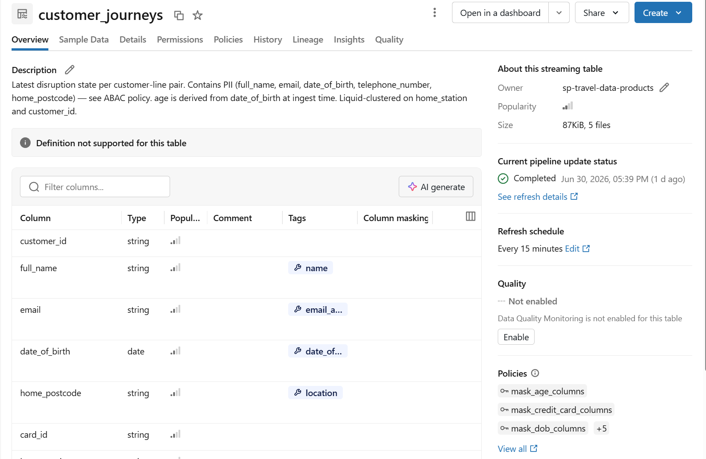
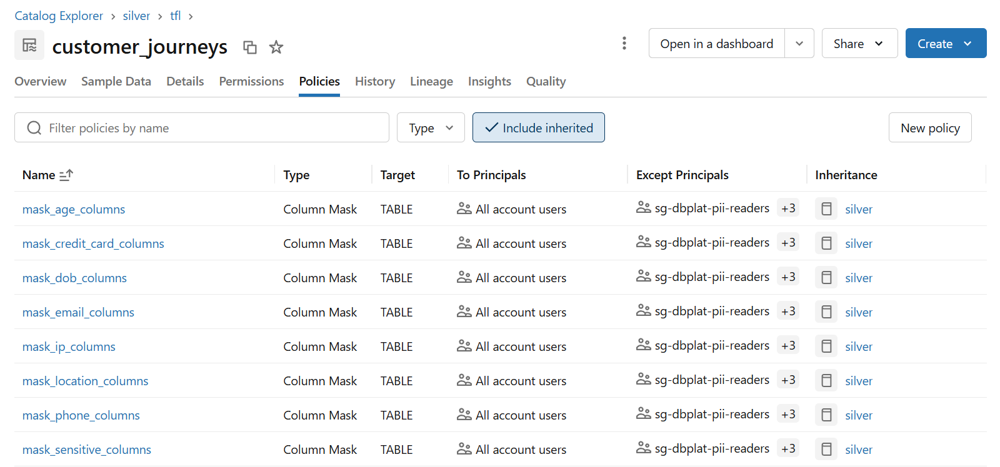
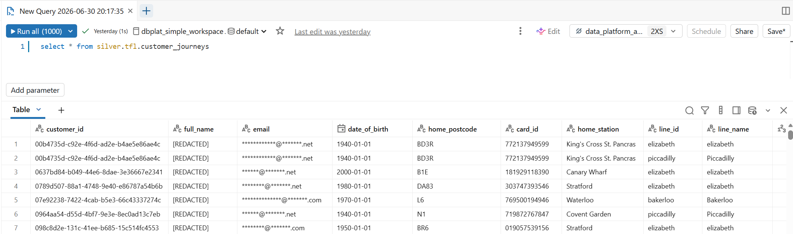
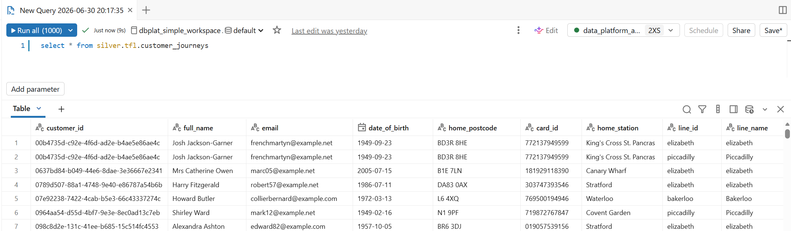

# Access control & PII governance

Who can see what PII, and how that's enforced and audited.

## Catalog access

Access follows a data mesh principle — all account users can browse every layer:

| Catalog | Account users | Team SP |
|---|---|---|
| `landing` | `USE_CATALOG`, `USE_SCHEMA` | `READ_VOLUME`, `WRITE_VOLUME` on owned volumes |
| `bronze` | `USE_CATALOG`, `USE_SCHEMA` | `ALL PRIVILEGES` on owned schemas |
| `silver` | `USE_CATALOG`, `USE_SCHEMA` | `ALL PRIVILEGES` on owned schemas |
| `gold` | `USE_CATALOG`, `USE_SCHEMA` | `ALL PRIVILEGES` on owned schemas |

Bronze is intentionally browse-only for account users — data access requires the team SP. Silver and gold are readable by all users but protected by ABAC column masking — standard readers see masked values; `pii-readers` and `data-stewards` see the raw data.

## ABAC column masking

Silver and gold carry Unity Catalog column mask policies driven by Databricks Data Classification (`class.*` governed tags). When Data Classification detects a PII or sensitive column, it applies a `class.*` tag; the matching policy then masks the value for standard readers.

**8 masking UDFs** in `admin.shared`:

| UDF | Example output |
|---|---|
| `mask_email` | `******@******.co.uk` |
| `mask_dob` | `1980-01-01` (decade of birth) |
| `mask_age` | `30` (INT) or `"30-39"` (STRING) |
| `mask_ip` | `192.168.*.*` |
| `mask_credit_card` | `**** **** **** 1234` |
| `mask_phone` | `+44 *** *** ****` |
| `mask_location` | `SW1A` (UK postcode outward code) or `[REDACTED]` |
| `mask_sensitive` | `[REDACTED]` |

9 policies per catalog cover all 25 GDPR + PCI DSS `class.*` tags explicitly. Databricks does not support namespace wildcards in policy conditions, so each tag is listed in exactly one policy. All policies are managed by the DABs governance job and are idempotent.

The same query against `silver.tfl.customer_journeys`, masked vs. unmasked:

### Governed tag ASSIGN permissions — manual step required

After each fresh deploy, `ASSIGN` must be granted once at account level to `sg-dbplat-governed-tags` — this covers all governed tags in one step. This cannot be automated — Databricks has not implemented governed tag permission management in the REST API or SDK. See **[governed-tag-grants.md](governed-tag-grants.md)** for the exact steps.

## Groups and access governance

Four Entra security groups govern access. Terraform creates them and manages membership; Databricks mirrors them via AIM (Automatic Identity Management):

| Entra group | Databricks role | Purpose |
|---|---|---|
| `sg-dbplat-data-platform-admins` | Account admin, metastore owner, workspace ADMIN | Platform operators |
| `sg-dbplat-data-stewards` | Workspace USER | Data quality and ownership — see unmasked data |
| `sg-dbplat-pii-readers` | Workspace USER | Access to raw PII-tagged columns |
| `sg-dbplat-standard-readers` | Workspace USER | Standard read access — masked data only |

The `data-platform-admins` group is seeded with the owner specified in the `OWNER` secret.

Two additional groups are managed by Terraform to minimise the governed tag ASSIGN grants:

- `sg-dbplat-data-product-sps` — holds all domain team SPs; new SPs are added automatically on each `terraform apply`
- `sg-dbplat-governed-tags` — nests `data-product-sps` and `data-stewards`; the single principal granted `ASSIGN` on all 18 governed tags

> **AIM and Terraform**: AIM can race against `terraform apply` when creating the Databricks mirror group for `data_platform_admins`. If an apply fails with "Group already exists", delete the Databricks group from the account console, then re-run the apply immediately before AIM re-syncs.

## Platform Access Audit dashboard

`dashboards/access_audit.lvdash.json` queries `system.access.audit` and provides:

- **KPI row** — PII table access events (7d), unique users (7d), failed auth events (7d), permission changes (30d)
- **PII access by user** — bar chart showing who is accessing silver/gold data (7d)
- **PII access trend** — daily access count to catch spikes (7d)
- **Recent permission changes** — grant/revoke events over 30d
- **Audit Detail page** — raw PII access log (7d, up to 1,000 rows) + failed auth events (7d)

PII access is tracked via `generateTemporaryTableCredential` events on `silver.*` and `gold.*`.
