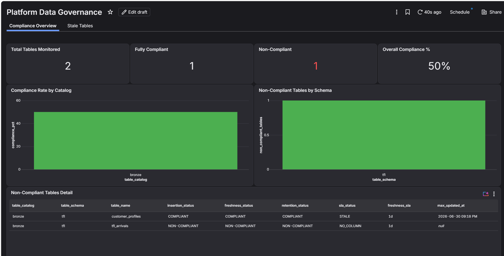
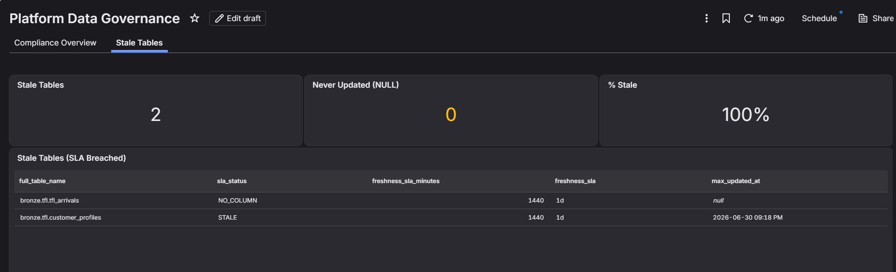

# Data lifecycle governance

Is the data fresh, retained correctly, and structurally compliant.

## Platform metadata column conventions

Every managed table in bronze, silver, and gold must carry three platform metadata columns. Teams are responsible for populating them in their pipelines:

| Column | Type | Set when | Purpose |
|---|---|---|---|
| `_inserted_at` | `TIMESTAMP` | First insert only — never updated | Immutable audit trail of when the row arrived in this layer |
| `_updated_at` | `TIMESTAMP` | Every write | Drives freshness SLA monitoring — staleness is measured against the table's configured SLA |
| `_delete_at` | `TIMESTAMP` | Set to the row's expiry date | Drives Auto TTL — the platform deletes rows after this date |

```python
# DLT example — all three columns populated by the pipeline
@dlt.table
def silver_journeys():
    return (
        dlt.read_stream("bronze_journeys")
        .withColumn("_inserted_at", current_timestamp())  # set once; use merge to preserve on updates
        .withColumn("_updated_at",  current_timestamp())
        .withColumn("_delete_at",   date_add(current_timestamp(), 365 * 7))  # 7-year retention
    )
```

Two governance jobs enforce these conventions:

**`platform-governance-setup`** — runs on every CI deploy. Creates/replaces masking UDFs and ABAC policies. DDL-only, no schedule needed.

**`platform-governance-daily`** — scheduled daily at 01:00 Europe/London, `pause_status: PAUSED` by default (suitable for demo environments — unpause in the Databricks UI when running live). Tasks:

- **`apply_auto_ttl`** — sweeps all managed tables that have `_delete_at` and applies `ALTER TABLE ... DELETE ROWS 0 DAYS AFTER _delete_at`. Idempotent.
- **`compute_freshness_metrics`** — queries `MAX(_updated_at)` per table and writes to `admin.shared.freshness_metrics`.
- **`create_retention_compliance_view`** — rebuilds `admin.shared.retention_compliance`, which surfaces structural compliance (`insertion_status`, `freshness_status`, `retention_status`) and operational SLA compliance (`sla_status`) for every managed table. Non-compliant and stale tables sort to the top.

```sql
SELECT * FROM admin.shared.retention_compliance WHERE sla_status = 'STALE';
```

### Per-table freshness SLAs

Teams set the acceptable staleness window per table as a table property. The value is visible in the Unity Catalog Explorer under the table's **Details** tab.

```sql
-- Real-time pipeline — expect updates every hour
ALTER TABLE silver.tfl.journeys
SET TBLPROPERTIES ('platform.freshness_sla' = '1h');

-- Reference data — acceptable to update weekly
ALTER TABLE gold.reference.station_codes
SET TBLPROPERTIES ('platform.freshness_sla' = '7d');
```

| Unit | Example | Minutes |
|---|---|---|
| `m` | `30m` | 30 |
| `h` | `4h` | 240 |
| `d` | `7d` | 10,080 |
| `y` | `10y` | 5,259,600 |

Default if not set: `1d` (1,440 minutes). The `compute_freshness_metrics` job reads the property from each table and stores it in `admin.shared.freshness_metrics` alongside `max_updated_at`. The compliance view derives `sla_status`:

| Value | Meaning |
|---|---|
| `FRESH` | Last updated within the SLA window |
| `STALE` | Last updated outside the SLA window |
| `NEVER_UPDATED` | `_updated_at` column exists but all values are null |
| `NO_COLUMN` | `_updated_at` column is missing (structural non-compliance) |
| `ERROR` | Freshness metrics computation failed for this table |

## Platform Data Governance dashboard

`dashboards/platform_data_governance.lvdash.json` is an AI/BI dashboard deployed by the DABs bundle. It provides:

- **KPI row** — total tables monitored, fully compliant count, non-compliant count, overall compliance %
- **Compliance rate by catalog** — bar chart per bronze/silver/gold
- **Non-compliant tables by schema** — which teams have the most gaps
- **Non-compliant tables detail** — full list with per-column status and SLA
- **Stale tables page** — tables breaching their `platform.freshness_sla` SLA

The warehouse is resolved automatically by name (`data_platform_admins-sql-warehouse`) — no hardcoded IDs.




