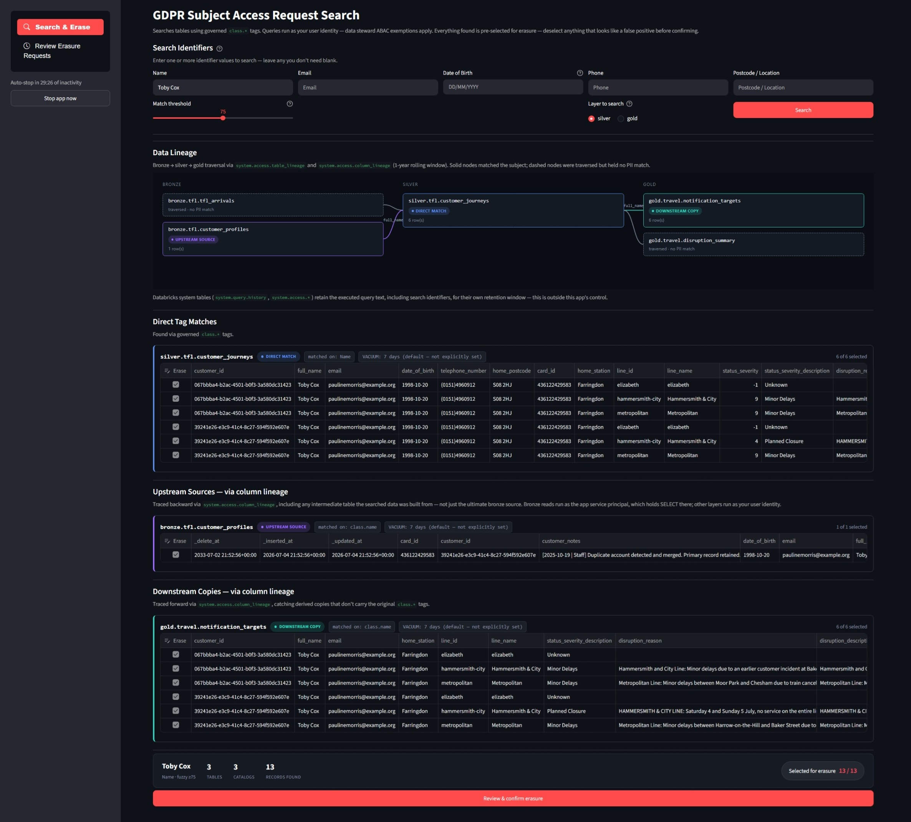
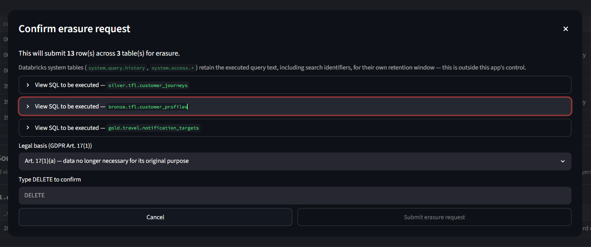
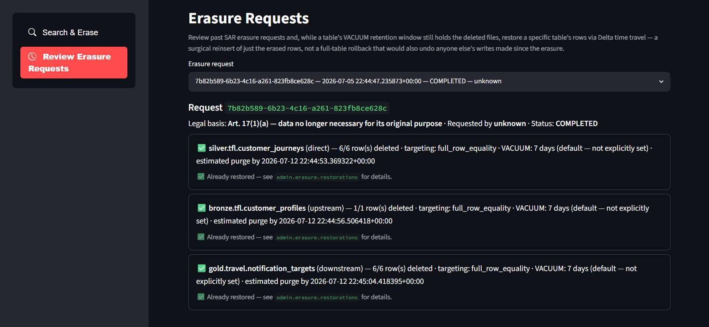

# GDPR Subject Access Request (SAR) search and erasure



The `platform-sar-app` Databricks App (`apps/sar_app/`) is a three-page tool for handling GDPR Subject Access Requests end to end: find every copy of a subject's data across the lakehouse, generate an Article 15 access report or review and confirm Article 17 erasure, and — if needed — undo an erasure while the underlying table's VACUUM retention window still holds the deleted files. It's a Streamlit app with a sidebar page switcher (`streamlit-option-menu`): **Search & Erase**, **Review Erasure Requests**, and **Review Access Requests**.

## Search & Erase

Search identifiers (Name, Email, Date of Birth, Phone, Postcode/Location) live on the main page rather than the sidebar, laid out across columns so all five are visible without scrolling; the "Layer to search" radio and Search button share the same row-band as the Name column's match-threshold slider, reusing space that would otherwise sit empty under the other four fields. Any field left blank is simply not searched — there's no separate "enable this identifier" checkbox.

Enter one or more values and click **Search**. Queries run under the calling user's own identity — data steward ABAC exemptions apply — against a chosen layer (bronze, silver, or gold; silver by default). When multiple identifiers are given, a row must satisfy all of the identifiers tagged on its own table; a table missing one of the selected identifiers is still searched on whichever it does have, since PII fields are often split across tables. Name search strips honorifics, expands nicknames (via the `nicknames` library), and ranks results by `WRatio` fuzzy score against an adjustable match threshold. Phone search normalises to the last 9 digits so any country-code prefix (`+44`, `0044`, …) still matches.

After a silver/gold search finds matches, the app automatically traces upstream column lineage to bronze via `system.access.column_lineage` (BFS, up to 10 hops), then searches those bronze tables for the same subject. Bronze queries run as the app's own service principal rather than the calling user — users don't have `SELECT` on bronze by design, and bronze columns don't carry governed tags. It also traces *downstream* copies via the same column lineage mechanism, catching derived tables that don't carry the original `class.*` tags. Column lineage carries the original tag and search value through intermediate hops, so the correct search conditions arrive at each table regardless of how many transformation steps sit between them.

Results render as a custom lineage map (bronze → silver → gold, solid nodes for matches, dashed for traversed-but-no-match) plus one review card per matched table, colour-coded to match the lineage map (blue = direct match, violet = upstream source, teal = downstream copy). Clicking a matched lineage node scrolls the page to its corresponding card. Every found row is pre-selected for erasure in an editable table — deselect anything that looks like a false positive before confirming.

Two actions sit below the results, side by side: **Review & confirm erasure** (Art. 17) opens a dialog showing the exact `DELETE` SQL for each table (on-screen only, never persisted), a GDPR Art. 17(1) legal basis selector, and a typed `DELETE` confirmation. **Generate Art. 15 access report** covers every row found above regardless of the erasure checkboxes — a subject's right of access isn't conditioned on what's marked for erasure — and is documented separately below.



### Erasure execution — all-or-nothing, no native transactions

Erasure runs as the app's own service principal (escalated beyond the calling user's privileges, since no single non-admin principal has delete rights across every team's tables). Execution is **all-or-nothing across every table in the request**: every target's delete predicate is dry-run (`SELECT COUNT(*)`) *before* any table is actually deleted, and only if every single dry-run matches its expected row count does any `DELETE` run at all. A mismatch on one table aborts the whole request without touching any other table — this can't be achieved with native Databricks multi-statement transactions here, since tables with row filters/column masks (which silver and gold both have, for ABAC) [cannot participate in a transaction at all](https://docs.databricks.com/aws/en/transactions/).

Row targeting uses the table's Unity Catalog primary key if one is declared, otherwise falls back to full-row equality across every column. Building the equality predicate is more subtle than it looks — see `apps/sar_app/erasure.py`'s `_sql_literal`/`_sql_string`/`_sql_timestamp`: TIMESTAMP columns need microsecond precision preserved (a literal truncated to whole seconds silently never matches a real value with sub-second precision), and string literals need backslashes escaped before quotes (Databricks SQL string literals process C-style escape sequences like `\n`/`\uXXXX`, so unescaped backslashes in free text or JSON blobs get reinterpreted into different characters than what's actually stored, breaking the comparison). Both were real bugs found by testing against live data, not hypothetical.

### Audit trail — `admin.erasure`

Every request writes to `admin.erasure` (owned by the `data_platform_admins` team, same Terraform mechanism as any domain team's schemas — see `terraform/data-product-teams.tf` + `terraform/catalogs.tf: databricks_grants.admin_erasure`):

| Table | Purpose |
|---|---|
| `requests` | One row per erasure case: hashed subject reference, requester, legal basis, overall status (`COMPLETED`/`PARTIAL`/`ABORTED`/`FAILED`) |
| `request_items` | One row per (request, affected table): rows selected/deleted, row-targeting method, hashed row keys, VACUUM retention, execution status (`SUCCEEDED`/`FAILED`/`SKIPPED`/`ABORTED`) |
| `restorations` | One row per restore *attempt* against a request_item (see below) |

This is evidence that erasure happened, never a copy of the erased data — subject and row identifiers are always hashed via `admin.shared.hash_subject_ref`/`hash_row_key` before being persisted, never stored as plaintext, and the executed DELETE/INSERT statements themselves are never persisted (only shown on-screen for review). Grants are Terraform-only and narrow: the platform team's SP for writes, data stewards for read-only review — there's no `GRANT ... TO account users` the way dashboard-facing views get.

## Review Erasure Requests — time-travel restore



The second page lists past requests and their per-table items, and lets a reviewer restore a `SUCCEEDED` table's rows via Delta time travel while its VACUUM retention window still holds the physical files.

Restore is a **surgical row reinsert, not `RESTORE TABLE`**: `RESTORE TABLE ... TIMESTAMP AS OF` rolls the entire table back to a prior version, which on a shared data-mesh table would silently revert any other team's writes made since the erasure too — not just the one request being undone. Instead: `find_pre_delete_version` correlates the request_item's recorded `executed_at` against the table's own `DESCRIBE HISTORY` to locate the DELETE operation (shown to the reviewer for a sanity check, including Delta's own `numDeletedRows` metric when available), time-travels to the version just before it, recomputes `hash_row_key(...)` for every row in that historical snapshot using the *exact same Python function* the original delete used to hash the rows it removed, keeps only the ones whose hash is already in the stored `row_key_hash` array, and inserts just those back. Reusing that one hashing function on both sides (rather than reimplementing the canonical-key join in SQL) is what keeps the two sides from drifting out of format sync — the same class of bug as the timestamp/backslash issues above would otherwise resurface here too.

Restoring requires typing `RESTORE`, selecting a reason, and (like erasure execution) runs as the app's own service principal. Each attempt is logged to `admin.erasure.restorations`, including which Delta version was actually read from, and an already-successfully-restored item shows "Already restored" instead of a button (preventing duplicate reinsertion).

## Access Reports (Art.15)

The app's original name — "GDPR Subject Access Request search and erasure" — was always slightly wrong: a genuine Subject Access Request is Article 15 (right of access, a *report* of the subject's data), while everything above is Article 17 (right to erasure). **Generate Art. 15 access report**, next to the erasure button on the Search & Erase page, closes that gap using the exact same search/lineage results already on screen — no separate search step, no new lakehouse read grants, since it only ever renders rows already fetched by the search pipeline.

### Column redaction review

A row matching the subject's search identifiers can still carry a *different* subject's personal data in another column — a shared booking row is the canonical example. The app cannot reliably tell "the subject's own other PII field" apart from "a different subject's PII in the same row," so it never auto-redacts. Instead, clicking the button pulls every `class.*`-tagged column present on each matched table (not just the ones the search matched against) and presents a per-column checklist, pre-checked for columns tagged with an identifier the search actually looked for (or untagged, non-governed columns) and pre-*unchecked* for any other governed column, with its tag shown so the reviewer can judge it before including it. Table and column `COMMENT` metadata (Unity Catalog `information_schema.tables`/`columns`) is shown alongside as drafting context — useful when set, but never a substitute for the reviewer's own judgment, since pipeline authors may not have set comments or may have stale ones.

### Report format — printable HTML, not JSON or a PDF library

The generated document is a single self-contained HTML file (inline CSS, a `@media print` stylesheet) rather than raw JSON or a PDF-generation dependency. A subject-facing disclosure needs to actually be readable, and the reviewer can open the downloaded file in a real browser tab and use Print → Save as PDF for a handoff-ready copy — no PDF library for this app to maintain. It covers Art. 15(1)'s required disclosures: confirmation of processing, purpose (the reviewer's required free-text entry — there's no purpose/recipient registry in this platform to auto-derive it from), categories of personal data (from the matched `class.*` tags), recipients (a static, truthful line reflecting what this platform actually models — internal platform and owning team only, no external processors configured; verify against real-world data flows outside this repo before relying on it), retention (per table, from `admin.shared.retention_compliance`'s `has_delete_at`/`freshness_sla` — deliberately not the erasure feature's VACUUM retention, which is a different concept: how long a *deleted* row's files survive, not a live row's retention policy), automated decision-making (none identified on this platform), and the subject's other rights (rectification, erasure, restriction, objection, portability, complaint to a supervisory authority). Redacted columns are dropped from the report entirely, not masked — Art. 15(4) is about not disclosing another person's data, not about showing a placeholder.

This build deliberately keeps the document fully template-based and deterministic — no LLM in the generation path. An LLM turning schema-level facts (table/column comments, tags, retention flags) into cover-sheet prose would be low-risk since it never sees the subject's actual data, but feeding the *disclosed rows themselves* to an LLM would create a new processing purpose and a new recipient (the model provider) needing its own disclosure under Art. 15(1)(c), and risks hallucinating facts into a document meant to be an accurate legal record — not attempted here.

Same reasoning as the "Download as CSV" CSS block above: that block stops *incidental* PII export during ordinary browsing, not a deliberate, reviewed, typed-confirmation-gated disclosure, which is the one legitimate export path this feature exists to provide.

### Audit trail — `admin.access`

Every generated report writes to `admin.access` (same ownership/grant pattern as `admin.erasure` — see `terraform/catalogs.tf: databricks_grants.admin_access`):

| Table | Purpose |
|---|---|
| `requests` | One row per access-report case: hashed subject reference, requester, overall status |
| `request_items` | One row per (request, source table): rows disclosed, columns included/redacted, hashed row keys |

Same "evidence, never a copy" principle as erasure: `admin.shared.hash_access_subject_ref`/`hash_access_row_key` (their own versioned salts, distinct from erasure's, so a hash here can't be mistaken for one erasure produced) hash the subject reference and row keys before persisting, and the generated report document itself is never stored server-side — it only ever exists as the reviewer's one-time download. There's no restorations-equivalent table; a disclosure has nothing to undo.

### Review Access Requests

The third sidebar page lists past access requests and their per-table items — read-only, no restore action, since there's nothing to undo. It adds one Art. 12(3) compliance aid the erasure review page doesn't need: a one-month response-deadline badge per request (on-time / overdue), computed from `requested_at`/`completed_at`, since this is exactly where a DPO would check SLA compliance.

### Explicitly out of scope for this pass

Article 12(5)'s "manifestly unfounded or excessive" refusal ground, an automated purpose/recipient inventory, and LLM-drafted narrative are all deliberately not built — none of them block a correct, minimal Art. 15 disclosure path, and building them ahead of a real requirement risks over-engineering a feature that, like erasure before it, is meant to grow incrementally.

## Idle auto-stop

Databricks Apps bill per hour while running and have no built-in scale-to-zero, so a rarely-used app left running racks up cost unattended. The app stops its own compute after `IDLE_TIMEOUT_MINUTES` (env var in `apps/sar_app/app.yaml`, default 30) since the last completed search, via a background watchdog using the app's own service principal (granted `CAN_MANAGE` on itself in `resources/apps/sar.yml`). A live countdown and a "Stop app now" button are shown in the sidebar for stopping it immediately instead of waiting out the timeout. Because the app can now be stopped between uses, the CI deploy workflow explicitly runs `databricks apps start platform-sar-app` before redeploying source code.

## Access

Restricted to `sg-dbplat-data-stewards` and `sg-dbplat-data-platform-admins`.

## Terraform grants for bronze/silver/gold access

The app SP needs `USE_CATALOG`/`USE_SCHEMA`/`SELECT`/`MODIFY` on bronze, silver, and gold alike (`MODIFY` is needed everywhere it can find PII, including bronze via upstream lineage tracing, to actually execute the confirmed delete — an earlier bronze-is-SELECT-only grant meant a real erasure request found and confirmed a bronze row, then failed with `PERMISSION_DENIED` on the delete itself, since the two-phase dry-run check only exercises `SELECT` and can't catch a missing `MODIFY` grant ahead of time), `EXECUTE` on `admin.shared` (to call the hash UDFs), and `SELECT`/`MODIFY` on `admin.erasure` and `admin.access`, plus `CAN_USE` on the platform SQL warehouse. These are granted via `var.sar_app_sp_id` in `terraform/terraform.tfvars`. The SP application ID is auto-generated by Databricks Apps on first deploy — retrieve it with:

```sh
databricks apps get platform-sar-app -o json | jq -r '.service_principal_id'
databricks service-principals get <id> -o json | jq -r '.applicationId'
```

After a `terraform destroy` + `terraform apply` + `databricks bundle deploy` cycle the workspace is recreated and the app gets a new SP with a new ID. Update `sar_app_sp_id` in `terraform.tfvars` and re-run `terraform apply` to restore access.

## Local development

The Databricks CLI's `apps run-local` command (CLI ≥ 0.250.0 — check with `databricks -v`, upgrade via `winget upgrade Databricks.DatabricksCLI` if needed) runs the actual `app.py` locally against the real workspace, rather than a mock. From `apps/sar_app/`:

```powershell
pip install -r requirements.txt

databricks auth login --host https://<workspace-host>   # one-time; interactive OAuth in a browser
databricks apps run-local -p <profile> `
  --env DATABRICKS_WAREHOUSE_ID=<warehouse-id> `
  --env DATABRICKS_TOKEN=<token from `databricks auth token -p <profile>`>
```

Two things `run-local` doesn't resolve automatically outside a full bundle context:
- `DATABRICKS_WAREHOUSE_ID` — `app.yaml`'s `valueFrom: 'sql-warehouse'` binding only resolves inside a deployed bundle, so pass it explicitly (find the ID via the SQL Warehouses page or `databricks warehouses list`; the platform one is named `data_platform_admins-sql-warehouse`).
- `DATABRICKS_TOKEN` — `app.py`'s `_get_token()` normally reads the `x-forwarded-access-token` header the real Databricks Apps proxy injects; locally there's no proxy, so it falls back to this env var. `get_service_principal_token()` (used for bronze search and for erasure/restore execution) also resolves via this token locally, meaning those code paths run as *your own identity* rather than the app's actual SP — fine for functional testing if you're in `data_platform_admins` (full privileges everywhere), but it doesn't exercise the SP's specific grant boundary. That's still best verified via a real CI deploy.

If your local machine has a leftover token cache from an older CLI version, `databricks auth login` may fail with a cache-format error; set `DATABRICKS_AUTH_STORAGE=plaintext` before logging in to force file-based token storage instead.
