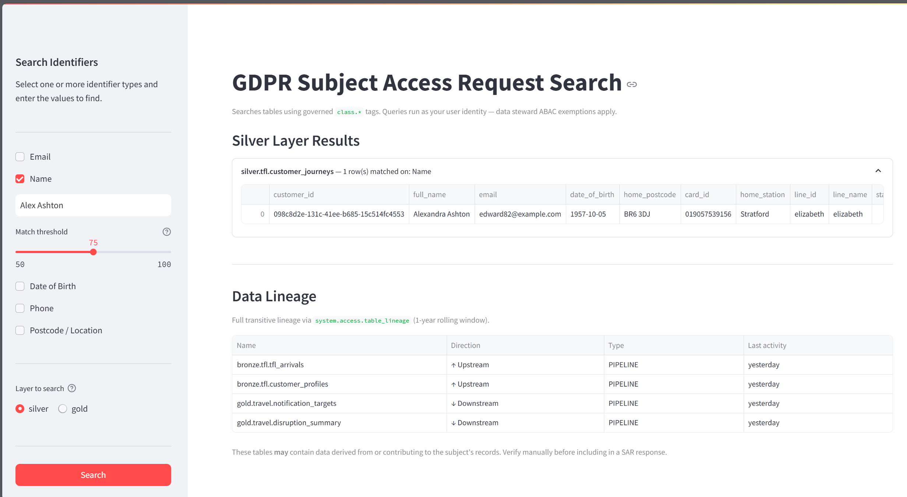

# GDPR Subject Access Request (SAR) search

The `platform-sar-app` Databricks App (`apps/sar_app/`) lets data stewards search all `class.*`-tagged columns interactively, across a chosen layer (bronze, silver, or gold — silver by default). Select one or more identifier types (email, name, DOB, phone, postcode/location), enter values, and the app returns matching rows across all tagged tables in that layer. When multiple identifiers are given, a row must satisfy all of the identifiers tagged on its own table — a table missing one of the selected identifiers is still searched on whichever it does have, since PII fields are often split across tables. Name search strips honorifics, expands nicknames (via the `nicknames` library), and ranks results by `WRatio` fuzzy score against an adjustable match threshold. Phone search normalises to the last 9 digits so any country-code prefix (`+44`, `0044`, …) still matches.

The lineage section shows full transitive upstream and downstream lineage for any matched table (1-year rolling window), using `system.access.table_lineage`.

Access is restricted to `sg-dbplat-data-stewards` and `sg-dbplat-data-platform-admins`.

## Idle auto-stop

Databricks Apps bill per hour while running and have no built-in scale-to-zero, so a rarely-used app left running racks up cost unattended. The app stops its own compute after `IDLE_TIMEOUT_MINUTES` (env var in `apps/sar_app/app.yaml`, default 30) since the last completed search, via a background watchdog using the app's own service principal (granted `CAN_MANAGE` on itself in `resources/apps/sar.yml`). A live countdown and a "Stop app now" button are shown in the sidebar for stopping it immediately instead of waiting out the timeout. Because the app can now be stopped between uses, the CI deploy workflow explicitly runs `databricks apps start platform-sar-app` before redeploying source code.
